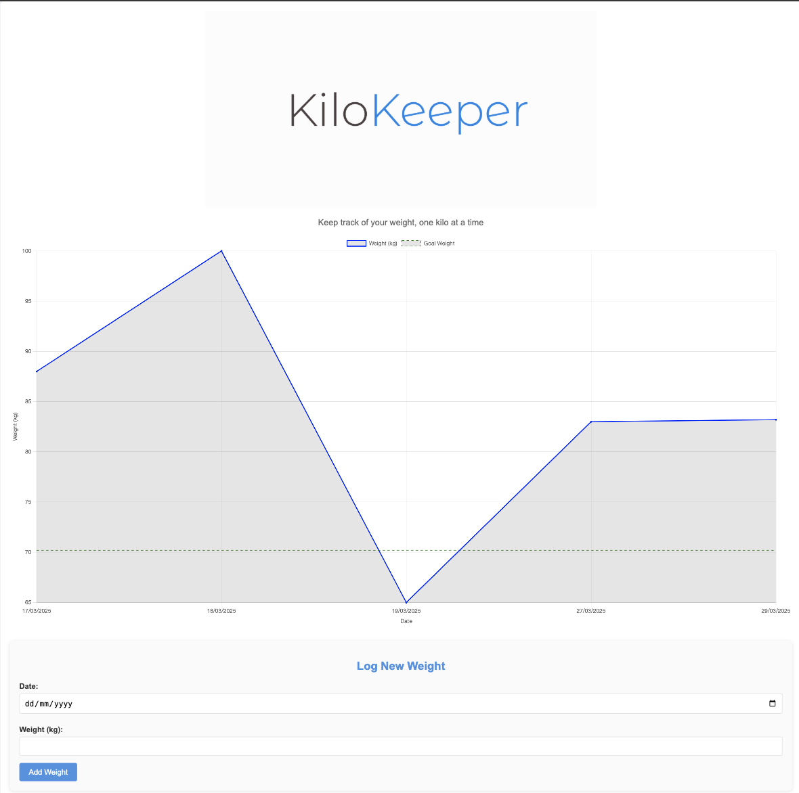

# KiloKeeper

A simple weight tracking application with a web-based interface that allows users to log their weight over time and visualize it using a chart.

## Features
- Log weight entries with date validation.
- View a historical graph of weight changes over time.
- Weight over time is displayed in a chart.
- Data is persisted in a JSON file (`weights.json`).

## Demo

See below screenshot for example



## Technologies Used
- **Backend:** Go (net/http)
- **Frontend:** HTML, JavaScript, Chart.js
- **Data Storage:** JSON files

## Setup and Installation

### Prerequisites
- Go installed (1.16+ recommended)
- A working web browser

### Steps to Run
1. **Clone the repository:**
   ```sh
   git clone https://github.com/thomaschaplin/kilokeeper.git
   cd kilokeeper
   ```
2. **Create required files and directories:**
   ```sh
   mkdir data
   touch data/weights.json
   ```
3. **Initialize the `weights.json` file:**
   ```json
   []
   ```
4. **Run the application:**
   ```sh
   go run main.go
   ```
5. **Access the web app:**
   Open `http://localhost:8080` in your browser.

## API Endpoints

### Get All Weights
**GET** `/weights`

### Add a New Weight Entry
**POST** `/weights/add`

#### Request Body (JSON):
```json
{
  "date": "DD/MM/YYYY",
  "kilograms": 75.5
}
```

## Future Improvements
- [ ] Store data in a database instead of JSON files.
- [ ] Implement user authentication.
- [ ] Add BMI calculation.
- [ ] Add age to chart based on global date of birth

## License
MIT License

---
Made with ❤️ by Thomas Chaplin

